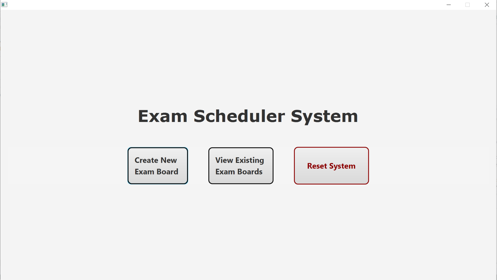
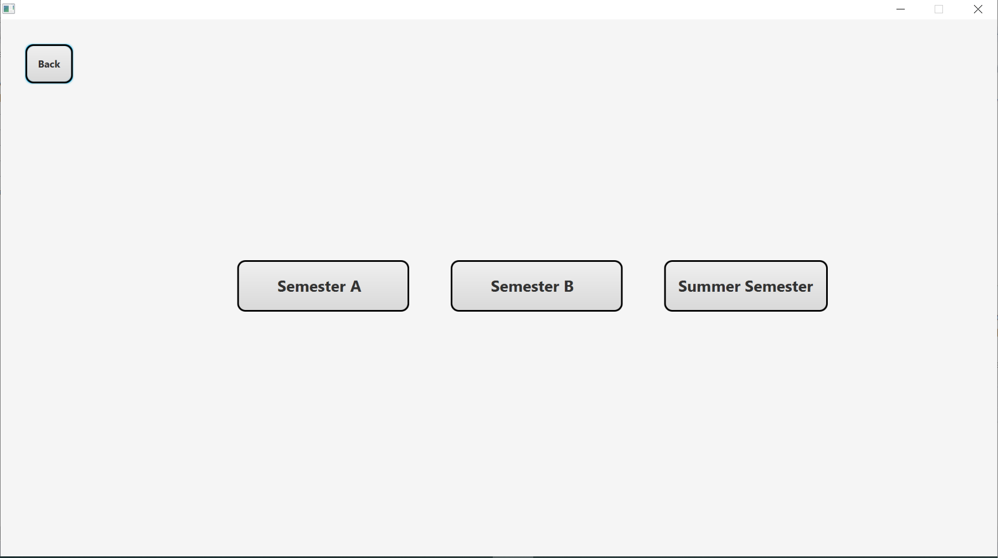
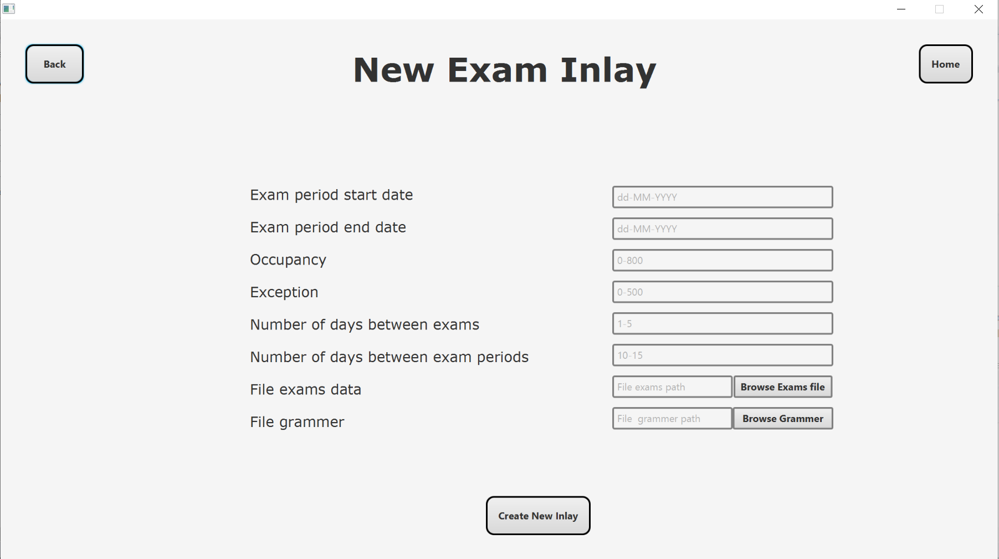
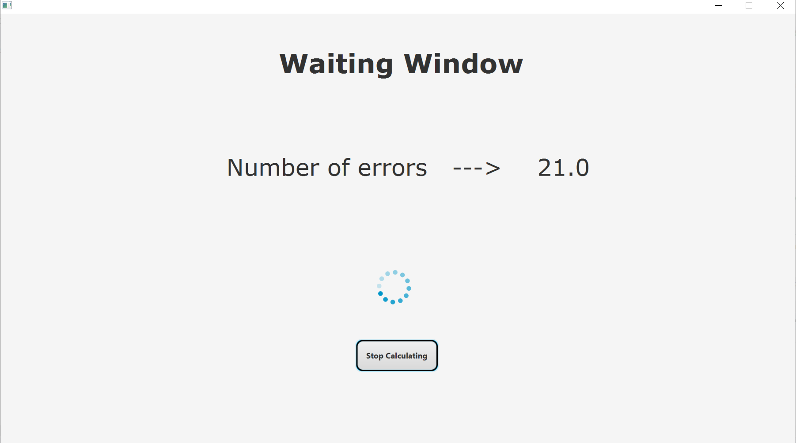
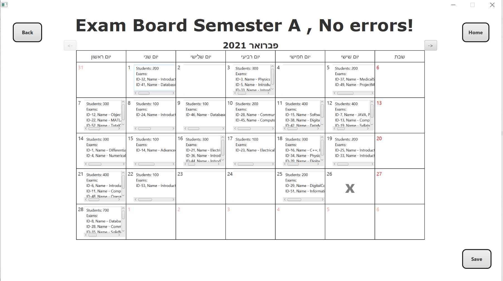
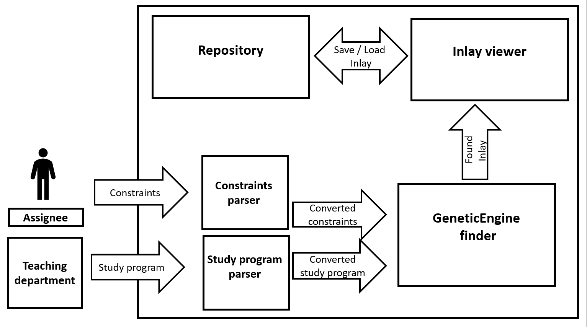

# A-system-for-assiging-exams
The project focuses on creating an automated exam inlay system.
The system finds an inlay within a few minutes, optimizes the inlay operation time.

Today, the system that my college is using is not automated and exam inlay is created in the following matter: the user embeds all of his exams manually, and to do so the user has to go over all of the exams one by one and place them by hand while taking into account other exams and the constraints between them. 
This process takes a lot of time and complicates things.

The system offers the user possible exams inlay for all exams in a particular semester, the inlay will be created according to the constraints that the user has inputted into the system. The system will try to produce an optimal inlay as possible for the user - meaning, creating an inlay that will answer as many user constraints as possible.
The system offers the user to enter constraints such as the difference in days between the exams. 
To make it easy to represent the constraints within the system, we created a new language with which we can easily describe the constraints of the exams and check if the constraints are met or not for a particular inlay.
For example, the constraint that describes the day difference is represented in our
language as follows:
x.id ! y.id > x.day DISTANCE   y.day >= 3

To ensure that the system presents an optimal final inlay, we used a genetic algorithm, its goal is to optimize the inlay and select the best inlay from all the inlays that the system randomly created.
The best inlay is the one that meets as many user constraints as possible.

   

   

   
